# 2017년 서울시 앱공모전 출품작(School Notification Service)

## 앱과 웹사이트 설명서입니다. 심사할 때 참고해주세요. 

### 공지 사용법
 먼저 https://jaeheon.com 에 접속합니다.
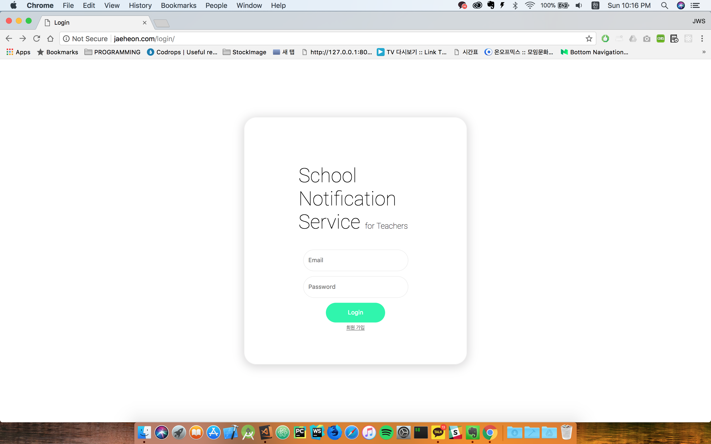

 계정을 생성합니다.
 테스트를 하실려면 아래의 계정을 써주시기를 바랍니다.
 ID : sunrin@sunrin.com
 PW : abcd
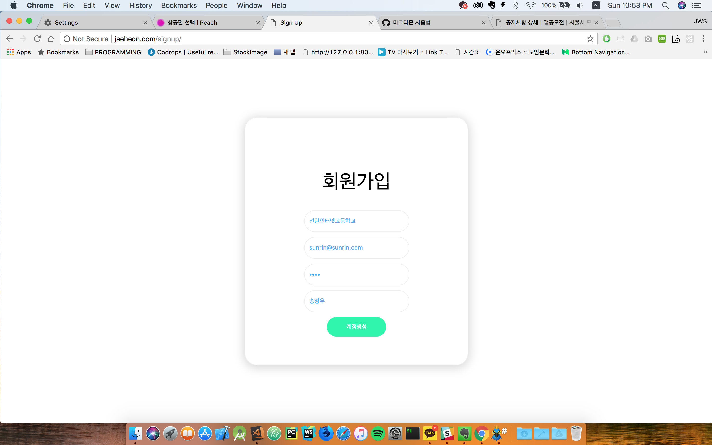

그리고 방을 생성합니다.
저는 선린인터넷고등학교#1-4라는 방을 생성하였습니다.
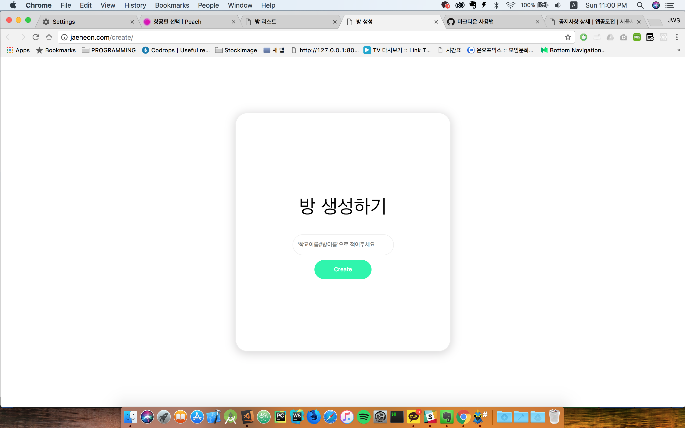
방이 아래와 같이 뜨지 않을 경우 새로고침을 해주세요.
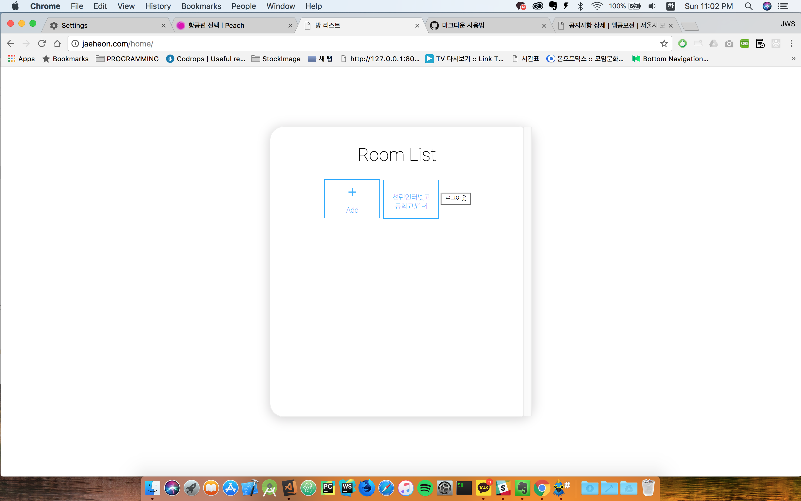

 SNS 애플리케이션을 다운받고 학생계정을 생성합니다.
 ID : stu@stu.com
 PW : abcd
 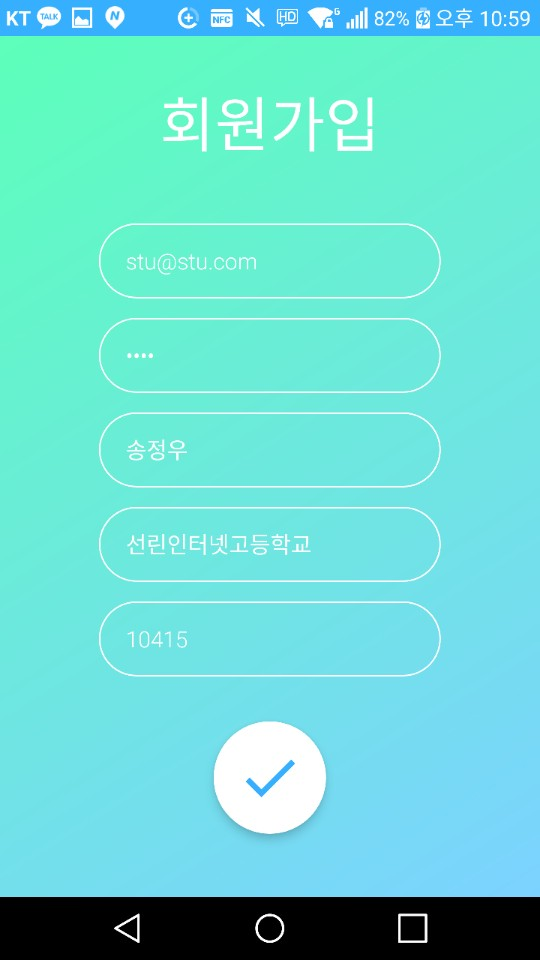
 
 그리고 생성한 방의 이름으로 접속합니다.
 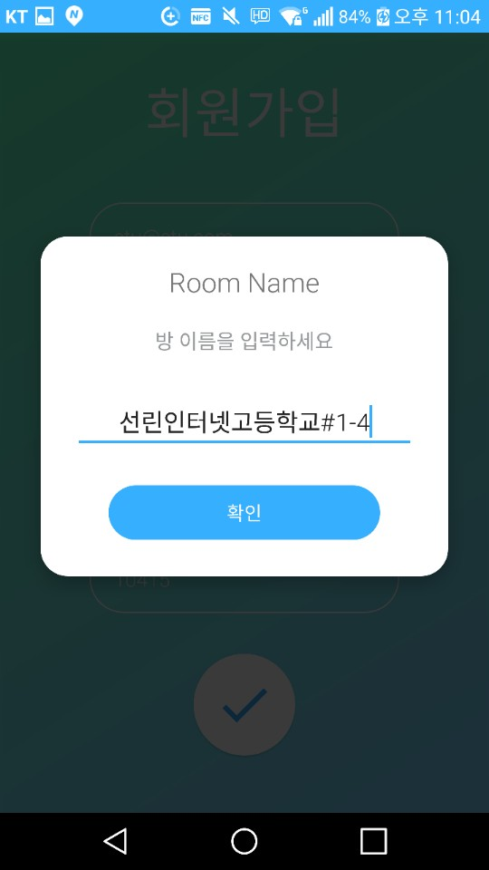
 
 생성한 계정으로 로그인을 합니다.
 로그인과 동시에 급식과 학사일정정보들을 다운받을 것 입니다.
 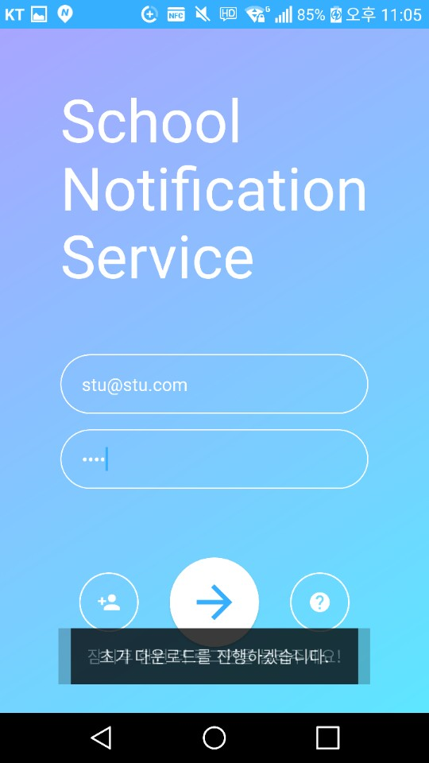
 
 SNS 웹사이트를 이용하여 공지를 보냅니다.
 아래의 방 중에서 공지를 보낼 방을 선택해주세요.
 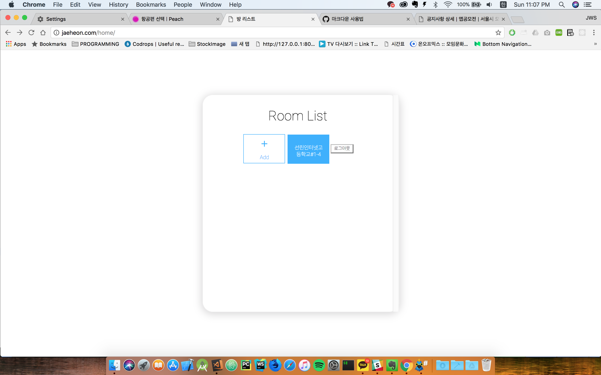	
 
 클릭 후 아래와 같은 페이지로 넘어가게 될 것 입니다.
 아래와 같이 공지를 써준 다음에 보냅니다.
 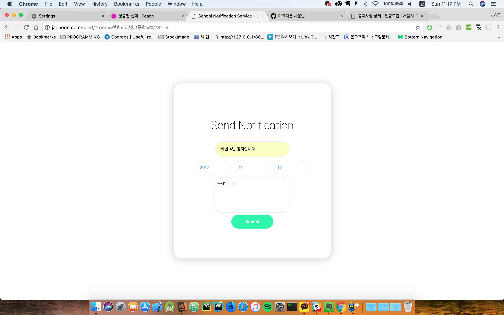

 공지는 SNS 애플리케이션 첫번째 페이지에 표시될 것이고 성공적으로 알림으로 뜰 것 입니다.
 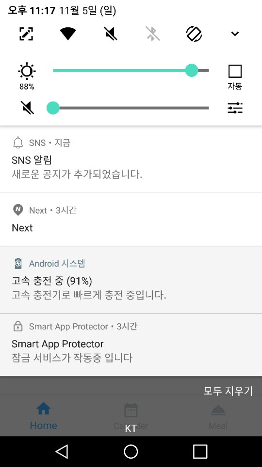
 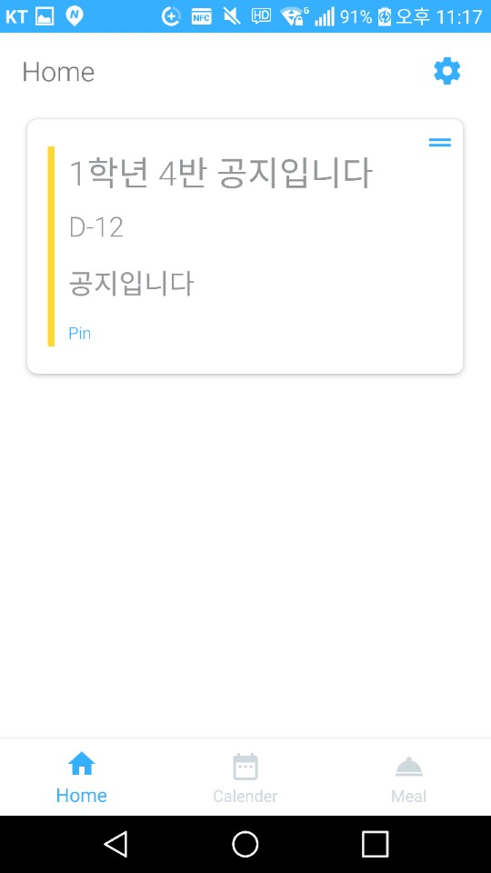

## 급식알림 사용법

 앱의 3번째 탭으로 들어갑니다.
 그리고 + 버튼을 누릅니다. 아래와 같은 화면을 보실 것 입니다.
 저는 11시 30분에 석식 알림을 받기로 하였습니다.
 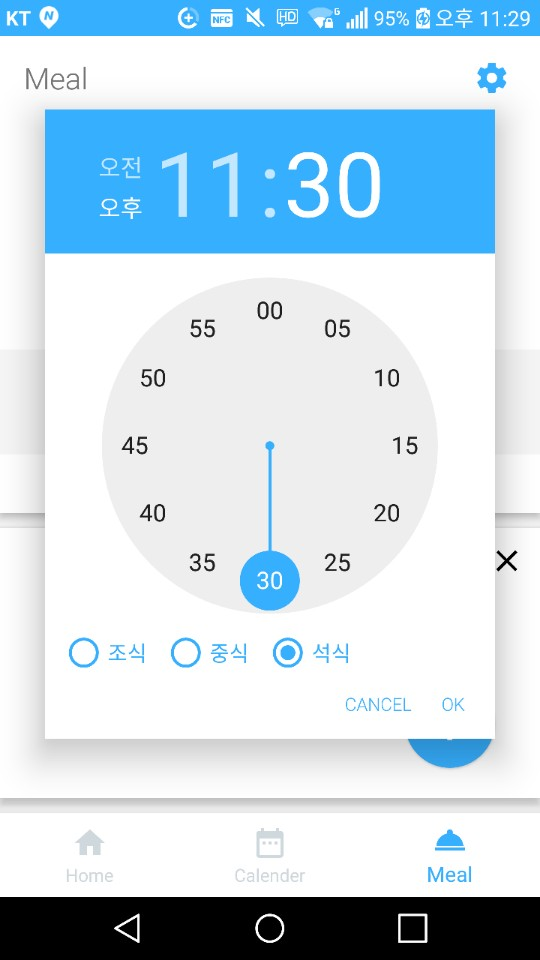

 11월 5일 11시 30분에 알림이 온 것을 확인 할 수 있습니다. 
 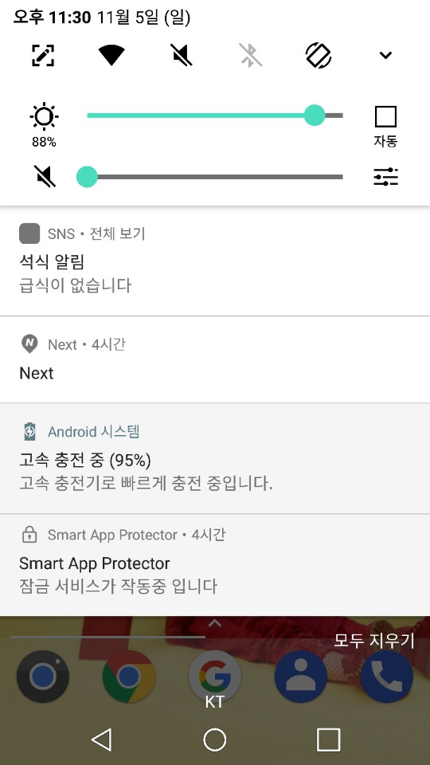
 
 
 
 
 #### 읽어주셔서 감사합니다. 
 #### 사이트에 접속이 안되거나 오류가 생길 경우 newmac7914@gmail.com 으로 꼭 연락주세요. 
